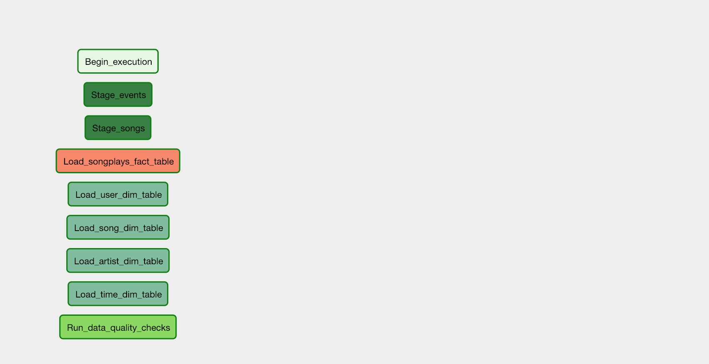

## Data Pipeline with Airflow

#### Project Description

A new music streaming app team called Sparkify wants to automate and monitor the data warehouse ETL pipelines using Apache Airflow. Their data resides in S3 and needs to be processed in data warehouse in Amazon Redshift. This project will create dynamic high grade data pipelines and are built from reusable tasks, monitored and easy backfills while maintaining data quality.

#### Project Datasets

- s3a://udacity-dend/song_data/
JSON files containing meta information about song/artists data
- s3a://udacity-dend/log_data/ 
JSON files containing log events from the Sparkify app

### Steps

**ETL process**
- Stages the raw data;
- transform the raw data to the songplays fact table;
- transform the raw data into the dimensions table too;
- check if the fact/dimensions table has at least one row.
   

**Configure the DAG**
 

**Builde the Operators**
- Stage Operators

Load JSON and CSV formatted files from S3 to Amazon Redshift, including timestamped files from S3 based on the execution time and run backfills.

- Fact and Dimension Operators

SQL Helper class helps to run data transformations. Dimension table loaders use truncate-insert pattern where the target table is emptied before the load. Fact tables are massive so they only allow append type.

- Data Quality Operator

Run checks on the data. Each test result and expected result is checked, if there is no match, the operator raise an exception and the task should retry and fail eventually.

### Database Schema and ETL process for Song Play Analysis 

#### Fact Table
- **songplays** : records in log data associated with song plays i.e. records with page NextSong
> songplay_id, start_time, user_id, level, song_id, artist_id, session_id, location, user_agent

#### Dimension Tables
- **users** : users in the app
> user_id, first_name, last_name, gender, level

- **songs** : songs in music database
> song_id, title, artist_id, year, duration

- **artists** : artists in music database
> artist_id, name, location, lattitude, longitude

- **time** : timestamps of records in songplays broken down into specific units
> start_time, hour, day, week, month, year, weekday

### Files Directory
- dag files: all the imports and task dependencies
- operators folder: with operators
- helper class: for the SQL transformations

### How to run scripts
After completing the code, type in the command: 
</opt/airflow/start.sh>
It would automatically start all the dags required and outputting the result to its respective tables  

